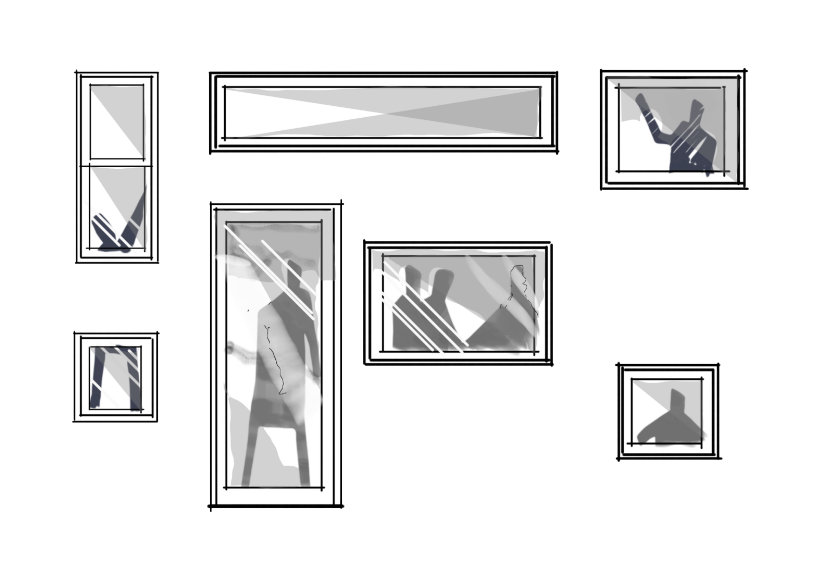

## Bienvenido 📉

La pandemia por la ventana es una página web, con formato de libro que recopila el trabajo del tío Numeral (apodado en Instagram), Alejandro Dinamarca, en [Numeral.lab](https://www.instagram.com/numeral.lab) en tiempos de pandemia.

:::{figure-md} markdown-fig


**Ilustración realizada por Bernardo Dinamarca**.
:::

El libro está dividido en distintas secciones, algunas respecto a las experiencias personales y otras en código de programación (hecho con cariño).

## Notas del autor

*Como siempre he recalcado, todo el trabajo realizado en pandemia fue en post de un bien común. Una especie de anhelo de devolver, en parte, una mano, a todo el mundo que me ha rodeado y del cual he aprendido, y espero seguir aprendiendo como un eterno aprendiz.*

*Este pequeño libro está dedicado a mis padres, a mis hermanos, familia y a mi amor. No sería nada sin ellos.*

*Dar las gracias al Dr. Cristóbal Corral y la Universidad Arturo Prat por el apoyo recibido, como también, por acojerme como estudiante y darme la posibilidad de desarrollar una idea que surgió desde el polvo.*

*Si bien este librito parece ser bastante serio, tiene un componente humano. Por lo que, a veces, en el relato se utilizarán algunas frases coloquiales.*

## Tabla de contenidos

La tabla de contenido de Jupyter Books (plataforma con la que se realizó esta página web) se encuentra a la izquierda, dividido por secciones, y a la derecha, encontrarás los apartados de cada una de las secciones. Las secciones, omitiendo la introducción, son:

```{tableofcontents}
```