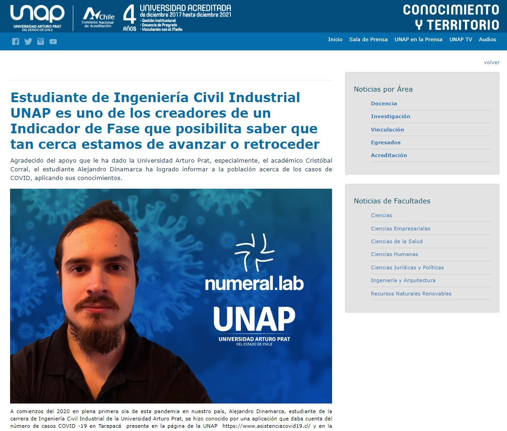

# Instituciones públicas

Numeral.lab nació bajo el alero de una iniciativa estudiantil, sumado a una iniciativa académica en la Universidad Arturo Prat, siendo apoyado por la institución, incorporándose como proyecto de vinculación a dicha Casa de Estudios.

## Ministerio de Ciencia, Tecnología, Conocimiento e Innovación

Aparecimos, en dos ocasiones, en el portal del Ministerio de Ciencia, Tecnología, Conocimiento e Innovación.

### 2020

Ambos reconocimientos datan del 2020.

#### ¿Cómo usa la comunidad la Base de Datos COVID-19?

En el <a href="https://minciencia.gob.cl/comunidad-covid19/">siguiente enlace</a> {cite}``minciencia``, el MICITEC "*recopila todas las iniciativas desarrolladas a partir de la Base de Datos COVID-19*" {footcite}``minciencia``.

##### Numeral.lab - Visualización de datos en Tarapacá

La primera aparición fue a raíz de un correo que envié al MICITEC, siendo respondido días después con la positiva de añadir la página de Numeral.lab - *en ese entonces, adinamarca.github.io* - a su sitio web {footcite}``minciencia``.

:::{figure-md} markdown-fig


**Numeral.lab - Visualización de datos en Tarapacá**. Imagen del <a href="https://minciencia.gob.cl/comunidad-covid19/">sitio web del MICITEC</a>.
:::

##### Asistencia COVID19

La segunda aparición fue a raíz de un nuevo correo que envié al MICITEC, esta vez, aludiendo a una mejora en la visualización de los datos gracias a la plataforma Infogram, siendo respondido días después con la positiva de añadir la página de la Universidad Arturo Prat - *asistenciacovid19.cl* - a su sitio web {footcite}``minciencia``.

:::{figure-md} markdown-fig


**Asistencia COVID19**. Imagen del <a href="https://minciencia.gob.cl/comunidad-covid19/">sitio web del MICITEC</a>.
:::

## Gobierno Regional de Tarapacá

### 2020

#### Entendiendo las curvas de contagio y el desafío de aplanarlas - II parte

Una breve charla en relación al aplanar las curvas de contagio.

:::{figure-md} markdown-fig


**Entendiendo las curvas de contagio y el desafío de aplanarlas - II parte**. Imagen del <a href="https://www.facebook.com/watch/live/?extid=SEO----&v=4143835965690381&ref=watch_permalink">Gobierno Regional de Tarapacá en su Facebook</a>.
:::

"*Entendiendo las curvas de contagio y el desafío de aplanarlas - II parte*" {cite}``gore``, por GORE Tarapacá {footcite}``gore``. 

:::{figure-md} markdown-fig


**Entendiendo las curvas de contagio y el desafío de aplanarlas - II parte**. Imagen del <a href="https://www.facebook.com/watch/live/?extid=SEO----&v=4143835965690381&ref=watch_permalink">Gobierno Regional de Tarapacá</a>.
:::

## Universidad Arturo Prat

Universidad en la cual desarrollé el proyecto de vinculación, durante el año 2020 y 2021, siendo un trabajo diario, voluntario y con alto compromiso.

Mejoré, de forma constante, reportes e información generada a partir de la base de datos del MICITEC, aprendiendo a la par, manejo de datos y visualización; brindé entrevistas y notas, en nombre de la Universidad y del proyecto de vinculación a la prensa local, además de hacer de una especie de "Community Manager" en Instagram, logrando sobre 5.000 seguidores en dicha red social.

### 2020

En este sentido, hicieron una nota en la UNAP en 2020, referente a la incorporación de la iniciativa Numeral.lab al sitio del Ministerio de Ciencia, Tecnología e Información.

#### Julio, 10

"*Aplicación web de estudiante UNAP hace accesible datos Covid 19 a la comunidad en página del Ministerio de Ciencias*" {cite}``unap1``, por la Universidad Arturo Prat {footcite}``unap1``.

:::{figure-md} markdown-fig


**Aplicación web de estudiante UNAP hace accesible datos Covid 19 a la comunidad en página del Ministerio de Ciencias**. Imagen de <a href="https://www.unap.cl/prontus_unap/site/artic/20200710/pags/20200710123250.html">la Universidad Arturo Prat</a>.
:::

### 2021

En 2021, una nota referente al desarrollo del Indicador de Fase.

#### Enero, 13

"*Estudiante de Ingeniería Civil Industrial UNAP es uno de los creadores de un Indicador de Fase que posibilita saber que tan cerca estamos de avanzar o retroceder*" {cite}``unap2``, por la Universidad Arturo Prat {footcite}``unap2``.

:::{figure-md} markdown-fig


**Estudiante de Ingeniería Civil Industrial UNAP es uno de los creadores de un Indicador de Fase que posibilita saber que tan cerca estamos de avanzar o retroceder**. Imagen de <a href="https://www.unap.cl/prontus_unap/site/artic/20210113/pags/20210113142515.html">la Universidad Arturo Prat</a>.
:::

## Consorcio de U. Estatales del Estado de Chile

Esta vez, nota en el Consorcio de Universidades del Estado de Chile.

### Julio, 10

"*Aplicación web de estudiante UNAP hace accesible datos Covid 19 a la comunidad en página del Ministerio de Ciencias*" {cite}``uestatales``, por el Consorcio de Universidades del Estado de Chile {footcite}``uestatales``.

:::{figure-md} markdown-fig


**Estudiante de Ingeniería Civil Industrial UNAP es uno de los creadores de un Indicador de Fase que posibilita saber que tan cerca estamos de avanzar o retroceder**. Imagen del <a href="http://www.uestatales.cl/cue/?q=node/7493">Consorcio de Universidades del Estado de Chile</a>.
:::

```{footbibliography}
```